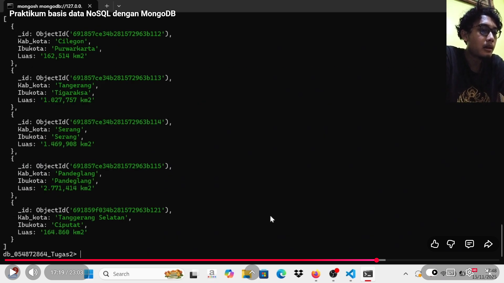

# NoSQL database lab with MongoDB
---
# 🏢 Mini Project NoSQL: Banten Province Data in Figures for 2024 / Data Provinsi Banten dalam Angka Tahun 2024

> **For Indonesia Language** (see below)
---

**Author:** Zidan6656  
**Source:** Self-made, college/personal project  
**License:** Free to use for learning purposes  

---

## 📖 Table of Contents
- [Description (English)](#-desciption-english)
- [Data Source](#-data-source)
- [Documentation Video](#-documentation-video)
- [Practicum Overview](#-practicum-overview)
- [Practiced NoSQL Concepts](#-practiced-nosql-concepts)
- [NoSQL Database Type Used](#-nosql-database-type-used)
- [Tools & Environment](#-tools--environment)
- [Files](#-files)
- [Notes](#-notes)

---

## 📌 Description (English)
This repository is part of my personal portfolio and documents a **hands-on NoSQL database practicum** demonstrated through a video recording.
The video showcases my practical understanding of **basic NoSQL database concepts and operations**, rather than a step-by-step tutorial.

---
## 📊 Data Source

The data used in this practicum was sourced from an **official government publication** before being observed and prepared for NoSQL processing.

**Provinsi Banten Dalam Angka 2024**  
(*Banten Province in Figures 2024*)  

- Publisher: **Badan Pusat Statistik (BPS) – Banten Province**
- Release Date: February 28, 2024
- Data Type: Official statistical data (demography, economy, social indicators)
- Data Accessibility: Public and open data

🔗 Source publication:  
https://banten.bps.go.id/id/publication/2024/02/28/e9b15e76302d4876c37f60be/provi

---

## 🎥 Documentation Video
Click the thumbnail below to watch the full explanation on YouTube:

  

Or access via the following link: https://youtu.be/8qpWJCGv_dc?si=HOYvINZ0pIbFDblY

---
## 📌 Practicum Overview

This practicum focuses on **applying NoSQL database concepts in practice**, including observing database behavior and 
understanding how NoSQL systems handle data differently from relational databases.

The video reflects my **hands-on learning process** with NoSQL databases.

---

## 🔰 Practiced NoSQL Concepts

During this practicum, I worked with the following concepts:

- Understanding the basic idea of NoSQL databases
- Observing schema-less data structures
- Exploring document-based databases
- Comparing NoSQL concepts with relational (SQL) databases
- Recognizing real-world use cases of NoSQL

---

## 🗂 NoSQL Database Type Used

**Document-Based NoSQL Database**
- Data stored in JSON-like documents
- Flexible structure without fixed schema
- Example technology: MongoDB

---

## 🛠 Tools & Environment
- MongoDB
- Visual Studio Code
- YouTube (video documentation)

---
## 📂 Files
- `EKonomi.JSON` 
- `Geografi.JSON`
- `Kependudukan.JSON`
-  query_examples.NoSQL` → Sample NoSQL queries.  

---

## 📝 Notes
- This project is a simple example for database learning. 
- Can be further developed according to needs.  

---

> **Author:** Zidan6656  
> **License:** Free for learning

<b> versi Bahasa Indonesia (klik untuk memperluas)</b>

## 📖 Daftar Isi
- [Deskripsi (Bahasa Indonesia)](#-deskripsi-bahasa-indonesia)
- [Sumber Data](#-sumber-data)
- [Video Dokumentasi](#-video-dokumentasi)
- [Gambaran Praktikum](#-gambaran-praktikum)
- [Konsep NoSQL yang Dipraktikkan](#-konsep-nosql-yang-dipraktikkan)
- [Jenis Basis Data NoSQL yang Digunakan](#-jenis-basis-data-nosql-yang-digunakan)
- [Tools & Lingkungan](#-tools--lingkungan)
- [Berkas](#-berkas)
- [Catatan](#-catatan)

---

## 📌 Deskripsi (Bahasa Indonesia)
Repository ini merupakan bagian dari **portofolio pribadi** saya dan berisi dokumentasi **praktikum basis data NoSQL** yang disajikan dalam bentuk video.

Video tersebut menunjukkan **pemahaman praktis saya terhadap konsep dasar dan pengolahan data menggunakan NoSQL**, bukan berupa tutorial langkah demi langkah.

---

## 📊 Sumber Data

Data yang digunakan dalam praktikum ini bersumber dari **publikasi resmi pemerintah** sebelum diamati dan dipersiapkan untuk pengolahan menggunakan basis data NoSQL.

**Provinsi Banten Dalam Angka 2024**  

- Penerbit: **Badan Pusat Statistik (BPS) Provinsi Banten**
- Tanggal Rilis: 28 Februari 2024
- Jenis Data: Data statistik resmi (demografi, ekonomi, dan indikator sosial)
- Akses Data: Publik dan terbuka

🔗 Tautan publikasi sumber:  
https://banten.bps.go.id/id/publication/2024/02/28/e9b15e76302d4876c37f60be/provi

---

## 🎥 Video Dokumentasi
Klik gambar di bawah ini untuk menonton video dokumentasi praktikum di YouTube:

  

Atau akses melalui tautan berikut:  
https://youtu.be/8qpWJCGv_dc?si=HOYvINZ0pIbFDblY

---

## 📌 Gambaran Praktikum

Praktikum ini berfokus pada **penerapan konsep basis data NoSQL secara praktis**, termasuk pengamatan perilaku basis data serta pemahaman perbedaan cara NoSQL mengelola data dibandingkan dengan basis data relasional (SQL).

Video ini merepresentasikan **proses pembelajaran langsung (hands-on)** saya dalam mempelajari NoSQL.

---

## 🔰 Konsep NoSQL yang Dipraktikkan

Dalam praktikum ini, konsep-konsep NoSQL yang dipelajari meliputi:

- Pemahaman dasar tentang basis data NoSQL
- Pengamatan struktur data tanpa skema tetap (schema-less)
- Eksplorasi basis data berbasis dokumen
- Perbandingan konsep NoSQL dengan basis data relasional (SQL)
- Pengenalan kasus penggunaan NoSQL di dunia nyata

---

## 🗂 Jenis Basis Data NoSQL yang Digunakan

**Basis Data NoSQL Berbasis Dokumen**
- Data disimpan dalam format dokumen menyerupai JSON
- Struktur data fleksibel tanpa skema tetap
- Contoh teknologi: **MongoDB**

---

## 🛠 Tools & Lingkungan
- MongoDB
- Visual Studio Code
- YouTube (dokumentasi video)

---

## 📂 Berkas
- `Ekonomi.json`
- `Geografi.json`
- `Kependudukan.json`
- `query_examples.nosql` → Contoh query NoSQL sederhana

---

## 📝 Catatan
- Proyek ini merupakan contoh sederhana untuk pembelajaran basis data.
- Dapat dikembangkan lebih lanjut sesuai kebutuhan dan studi lanjutan.

---

> **Penulis:** Zidan6656  
> **Lisensi:** Bebas digunakan untuk pembelajaran
